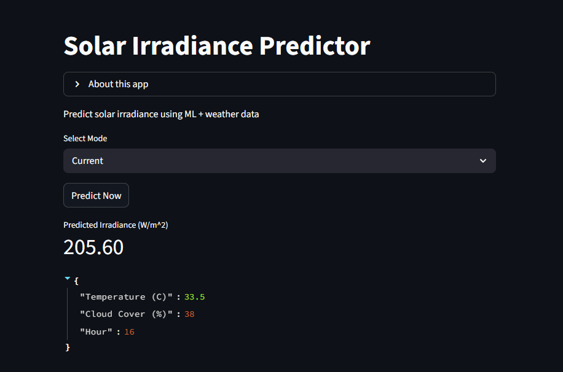
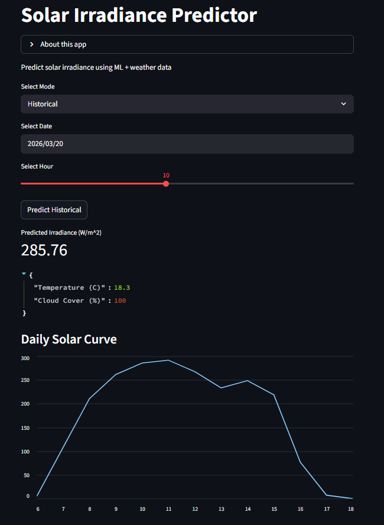
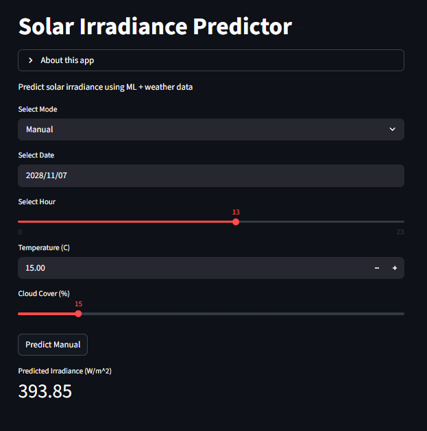

# Solar Irradiance Prediction using Machine Learning

This project builds an end-to-end machine learning system to predict solar irradiance 
using weather data and time-based features. 
It includes data processing, model development, evaluation, and a deployed web application 
for real-time and simulated predictions.

---

## Overview

Solar irradiance depends on time of day, seasonality, temperature, and cloud cover. 
This project models these relationships using regression techniques and deploys the 
final model through an interactive web application.

---

## Features Used

- Temperature  
- Hour of the day  
- Day of the year  
- Cloud cover  

---

## Approach

- Collected solar irradiance and weather data using NASA and weather APIs  
- Performed exploratory data analysis to understand patterns and trends  
- Engineered time-based and weather features  
- Built and compared multiple models:
  - Linear Regression  
  - Polynomial Regression  
  - ElasticNet  
  - XGBoost  
- Evaluated models using R² and MAE  
- Selected XGBoost as the final model  

---

## Key Insights

- Solar irradiance follows strong daily and seasonal patterns  
- Cloud cover significantly improves prediction accuracy  
- Tree-based models handle non-linear relationships effectively  

---

## Web Application

The Streamlit app allows users to predict solar irradiance in three modes.  
The model is trained on historical data (2022–2023), and different modes use this information in different ways.

---

### Current Mode

Uses live weather data (temperature and cloud cover) along with current time features to estimate real-time solar irradiance.



---

### Historical Mode

Uses archived weather data for a selected past date and hour, and visualizes the full-day solar irradiance curve.

This is called *historical* because it uses actual recorded weather conditions rather than simulated or real-time inputs.



---

### Manual Mode

Allows users to manually input temperature, cloud cover, and time to simulate irradiance.

This is useful for future scenarios or "what-if" analysis where actual weather data is not available.


---

## Project Structure

```text
solar-irradiance-prediction/
│
├── app/
│   └── app.py
│
├── model/
│   └── xgboost_irradiance_v1.joblib
│
├── notebooks/
│   └── project.ipynb
│
├── extras/
│   └── experimental files
│
├── requirements.txt
└── README.md
```


## How to Run

1. Create virtual environment:

```text
python3 -m venv venv
source venv/bin/activate
```

2. Install dependencies:

```text
pip install -r requirements.txt
```

3. Run the app:

```text
streamlit run app/app.py
```

4. Open in browser:

```text
http://localhost:8501
```

---

## Limitations

- Uses hour as a proxy for solar position  
- Slight inaccuracies near sunrise/sunset  
- Depends on external weather API accuracy  

---

## Conclusion

This project demonstrates a complete ML workflow from data collection to deployment, 
with a focus on meaningful feature engineering and 
practical usability through a web application
